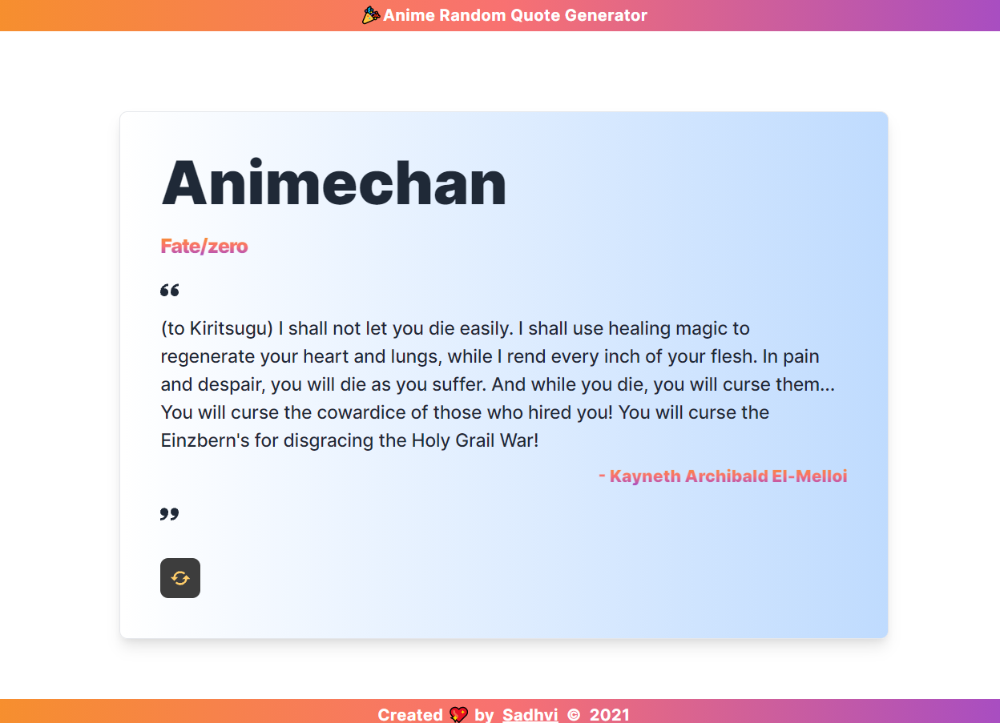

# Anime Random Quote Generator

This project is built using React.js and TailwindCSS. This build uses [Animechan](https://animechan.vercel.app/api/random) which is a free restful API serving quality anime quotes.

🔍 Frameworks & Tools:

- **React**: [https://react.dev/](https://react.dev/)
- **TailwindCSS**: [https://tailwindcss.com/](https://tailwindcss.com/)

## 🌐 Live Demo

Experience the live version of the application [here](https://animechan-react.netlify.app/).

## 🖼️ Preview



## 🛠️ Installation

Follow these steps to install and run the project on your local machine:

### Prerequisites

Before you begin, ensure you have met the following requirements:

- **Node.js**: [Install Node.js](https://nodejs.org/)
- **npm (Node Package Manager)**: Included with Node.js

### Clone the Repository

1. Clone this repository to your local machine using the following command:

   ```bash
   git clone https://github.com/Sadhvi10/anime-random-quote-generator.git

### Start the development server

2. Install npm and start the development server (localhost:3000) using the following command:

   ```bash
   npm i && npm run start

